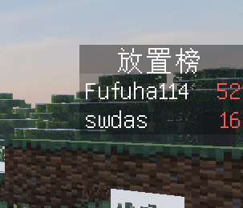
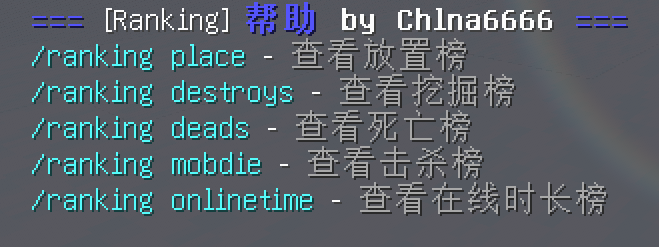
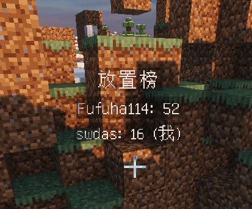

# Ranking

这是一个 Minecraft 服务器排行榜插件，根据玩家的统计数据（如放置方块数量、破坏方块数量、死亡次数、击杀数量和在线时长等）生成排行榜，并在游戏中显示。



## 功能特点
- **多种排行榜类型**: 插件支持放置、破坏、死亡、击杀和在线时长等多种排行榜类型。
- **可自定义开关**: 每种排行榜类型可根据服务器需求进行自定义开启或关闭。
- **多种数据存储方式**: 支持 JSON 文件、数据库和 MySQL 数据库等多种数据存储方式。
- **多语言支持**: 插件提供英文和简体中文两种语言支持，可根据服务器语言偏好进行选择。

## 配置文件介绍

```yaml
# 排行榜插件配置文件

# 选择语言
language: zh_CN  # 可选值: en_US (英文), zh_CN (简体中文)

# 排行榜开关设置
leaderboards:
  place: true   # 启用放置排行榜
  destroys: true   # 启用破坏排行榜
  deads: true   # 启用死亡排行榜
  mobdie: true   # 启用击杀排行榜
  onlinetime: true   # 启用在线时长排行榜

# 数据存储方式设置
data_storage:
  method: json   # 数据存储方式，可选值: json (JSON 文件), db (数据库), mysql (MySQL 数据库)
  location: /plugins/Ranking/data   # 数据存储位置，仅在选择 json 存储方式时有效
```

## 使用方法
1. 将插件放置在服务器的插件目录中。
2. 根据需要编辑配置文件，配置排行榜开关和数据存储方式。
3. 在游戏中使用相应的命令查看排行榜。

## 插件命令

- `/ranking <子命令>`: 主命令，用于查看排行榜和其他功能。
  - 别名: `/rk`
  - 用法: `/ranking <子命令>`
  - 子命令可选项:
    - `place`: 查看放置榜排行榜。
    - `destroys`: 查看挖掘榜排行榜。
    - `deads`: 查看死亡榜排行榜。
    - `mobdie`: 查看击杀榜排行榜。
    - `onlinetime`: 查看在线时长榜排行榜。
    - `help`: 查看帮助信息。
# PAPI



### 功能说明：
- 获取玩家排名数据
- 使用占位符 {ranking_place} 可以获取当前玩家的排名。
- 使用占位符 {ranking_place_<rank>} 可以获取指定排名的玩家数据，例如 {ranking_place_1} 获取排名第一的玩家数据。

#### 获取玩家破坏数、死亡数、怪物击杀数和在线时间：
- 使用占位符 {ranking_destroys} 获取当前玩家的破坏数。
- 使用占位符 {ranking_destroys_<rank>} 获取指定排名的玩家破坏数，例如 {ranking_destroys_1} 获取排名第一的玩家破坏数。
- 同样的方式可以应用于死亡数 {ranking_deads}, 怪物击杀数 {ranking_mobdie} 和在线时间 {ranking_onlinetime}。

### 示例用法：
- 获取当前玩家的（自己）排名：{ranking_place}
- 获取排名第一的玩家破坏数：{ranking_destroys_1}
- 获取排名第三的玩家在线时间：{ranking_onlinetime_3}